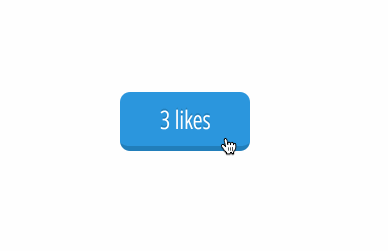

# 11/24/15

___This homework is due by 8am, on 11/25/2015____

# Build a like button with React

## Description
Using React, build a like button. The button should keep track of how many times it has been clicked and update its count each time it is clicked.

## Objectives

### Learning Objectives

After completing this assignment, you should...

* Understand how React state works.
* Understand how to build out React events.

## Normal Mode
* Replicate the following behavior using React.
* The count on the button should increase upon `click`
* The text on the like button should correctly pluralize its self. For example: 0 likes, 1 like, 2 likes ...

## Hard Mode
* Make the like button refer to a specific record in a parse.com database by passing it a model and updating the amount of likes by using Backbone.Model.save() 

### Deliverables

- Fork this repo and provide a link to either ghpages or surge.